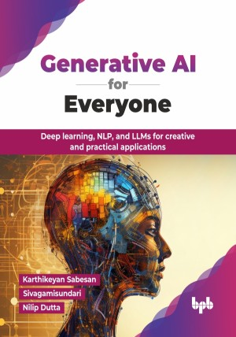

# Generative AI for Everyone

Deep learning, NLP, and LLMs for creative and practical applications.

This is the repository for [Generative AI for Everyone
](https://bpbonline.com/products/generative-ai-for-everyone?variant=44394000974024),published by BPB Publications.

## About the Book
Generative AI is revolutionizing the way we interact with technology. Imagine creating hyper-realistic images, composing original music pieces, or generating creative text formats, all with the help of AI. This book provides a comprehensive exploration of generative AI and its transformative impact across various industries.

This book begins with the basics of AI, explaining ML and design patterns to build a solid foundation. It delves deeply into generative AI and then progresses through machine learning, deep learning, and essential architectures such as CNNs, GANs, Diffusion, RNNs, LSTMs, and Transformers. It covers practical applications, from regression and classification to advanced use cases such as image generation, editing, document search, content summarization, and question answering. Readers will also learn to build prototypes like a Document Q&A bot, research assistant, and prompt playground, while mastering techniques such as continued pre-training, fine-tuning, model merging, retrieval-augmented generation, and agentic AI. 

By the end of this book, you will transform from a curious beginner to a confident, generative AI user. You will possess the knowledge and skills to explore its capabilities for creative expression, problem-solving, and even business innovation. You will be able to confidently navigate the world of generative AI, turning your ideas into reality.

## What You Will Learn
• Explore concepts of AI, ML, deep learning, and generative AI.

• Learn about computer vision and generative image AI supported by coding examples.

• Discover NLP Techniques, Transformer architecture components and generative text AI supported by coding examples.

• Understand prompt engineering and LLM frameworks while building prototypes.

• Examine the role of LLM operations throughout the entire LLM lifecycle.

• Investigate the potential impact of generative AI on enterprises and develop business strategies.
